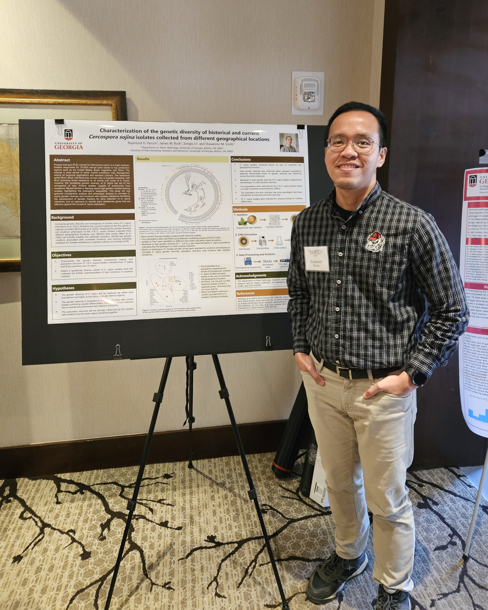

::: {.post-image}
{fig-alt="Ray standing beside his poster"}
:::

I had the opportunity to be one of the poster presenters at the recently concluded GAPP 2025. Listening to plenary speakers about their research was informative and inspiring, and talking to fellow plant pathologists about my research was exciting and fun! 
