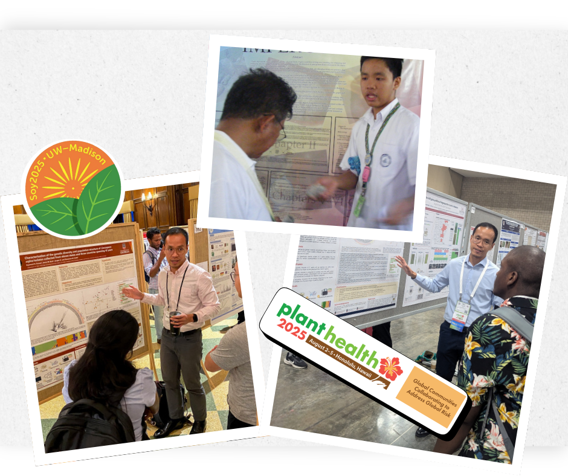

I vividly remember how I kept on wishing to win in our science high school fair, hoping for a chance to present our little science project at regional level. Having earned the opportunity twice, it was one of the few moments that gave me a sense of being good at something, in a time when all I carried was self-doubt.

That kid, proud and grateful for making into regionals, had no idea he would one day share his passion for research on an international stage, beside scientists he once thought only exist in textbooks. 

::: {.post-image}
{fig-alt="Ray standing beside his poster"}
:::

I'm incredibly thankful for the opportunity to attend my first and second national scientific conferences to present my PhD research,

🧬 **Soy 2025: 19th Biennial Conference on Molecular & Cellular Biology of Soybean**
  📅 July 23–26, 2025
  🏫 University of Wisconsin–Madison
  📍 Madison, Wisconsin

🌱 **Plant Health 2025: International Annual Meeting of the American Phytopathological Society**
  📅 August 2–5, 2025
  🌺 Hawaii Convention Center
  📍 Honolulu, Hawaii

I’m deeply grateful to my research mentors, Dr. Shavannor Smith and Dr. James Buck, for their encouragement and support, to UGA Plant Pathology Department for defraying Plant Health 2025 registration, and to the UGA Graduate School for awarding me an International Travel Grant.
These moments only strengthen my drive to pursue meaningful, translatable research for the benefit of the growers and the agricultural community. 🌱🔬🧬 

Cheers! 🍻
