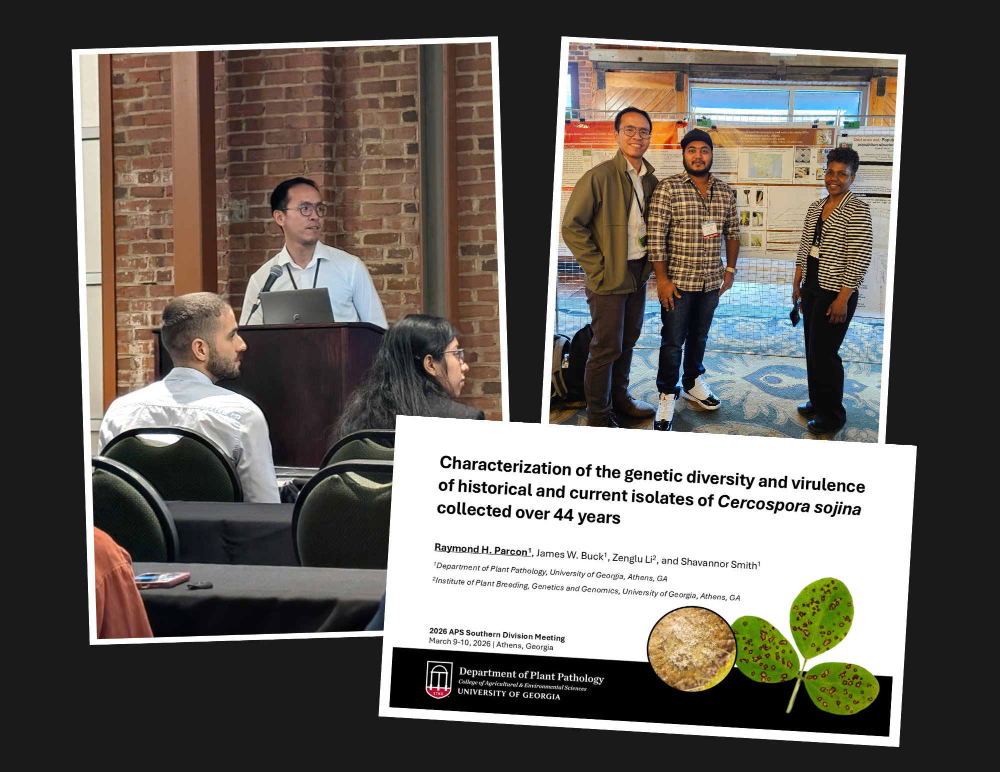

::: {.post-image}
{fig-alt="Ray doing an oral presentation"}
:::

I’m grateful for the opportunity to share my research and the work I'm doing at the 2026 American Phytopathological Society Southern Division Meeting in Athens, Georgia.

Being surrounded by people who share the same passion for plant pathology makes the experience even more meaningful. It’s inspiring to know that the research we do has the potential to make a real impact, especially for the communities and the growers who rely on it the most. 👨🏽‍🌾🌱

I’m also deeply thankful for the support and mentorship of my advisors, who inspire me to keep growing and to take on new challenges. 💪🏽