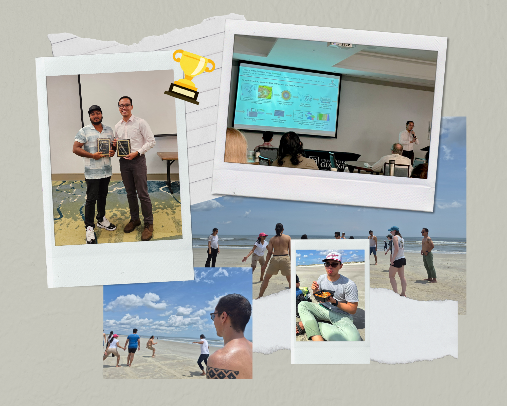

I'm honored to be recognized as the top oral presenter among the amazing presentations at the recently concluded Georgia Association of Plant Pathologists 2026 Meeting. I'm also proud to have shared the moment with my lab mate, Sai, who also won in the poster category. Our hearts are full to represent the research that we do, and the support and encouragement we receive from the Smith lab. 🔬🧬

::: {.post-image}
{fig-alt="Ray doing an oral presentation"}
:::

I'm especially grateful to my advisors, Dr. Shavannor Smith and Dr. James Buck for their encouragement and for trusting me with this research to be able to share it, and to the UGA Department of Plant Pathology for fostering events like this where we can connect with our peers and share ideas. 

And finally, to my colleagues and friends who have made the experience amazing! To have shared with them the beach sands of Cumberland and Jekyll Islands playing the Filipino game 'patintero,' drinking probably one too many Bahama Mama 🍹, and simply making the whole experience so unforgettable! 😍

Cheers to agriculture! 👨🏽‍🌾🌱 