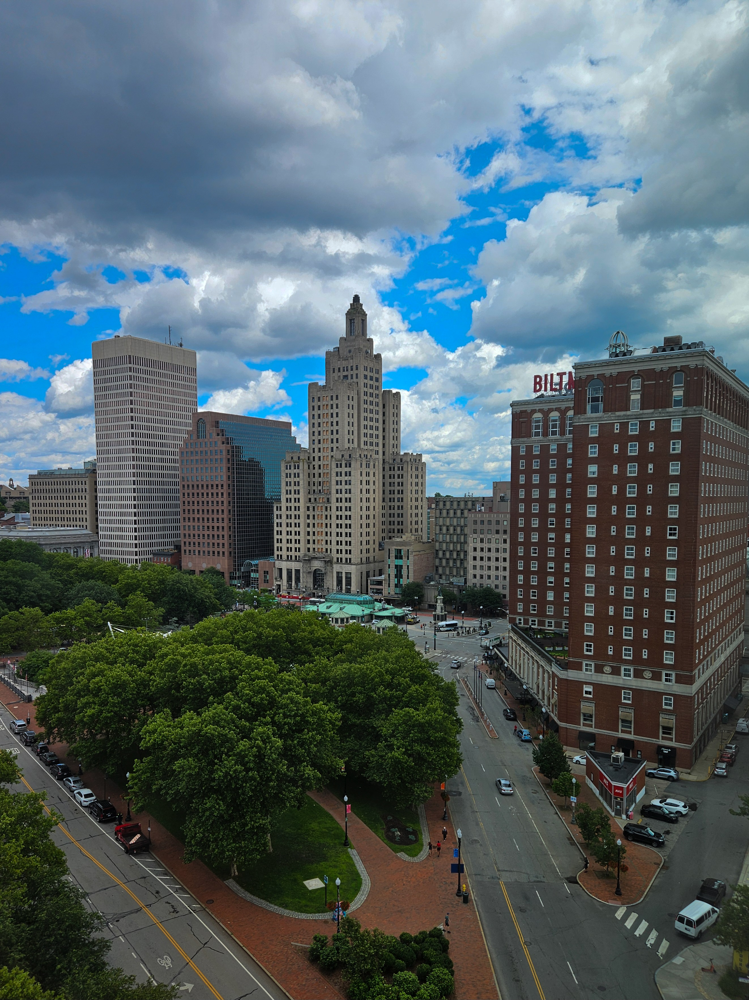
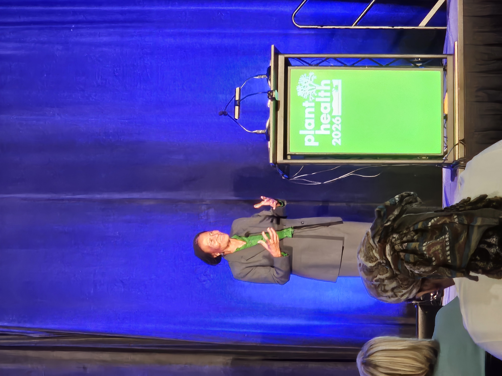
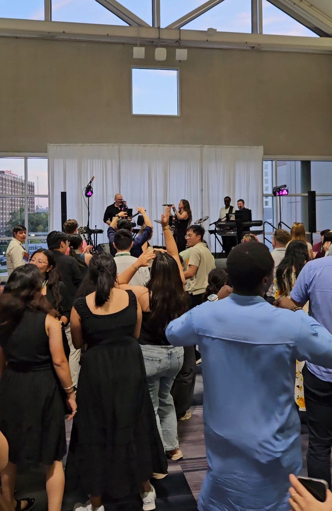
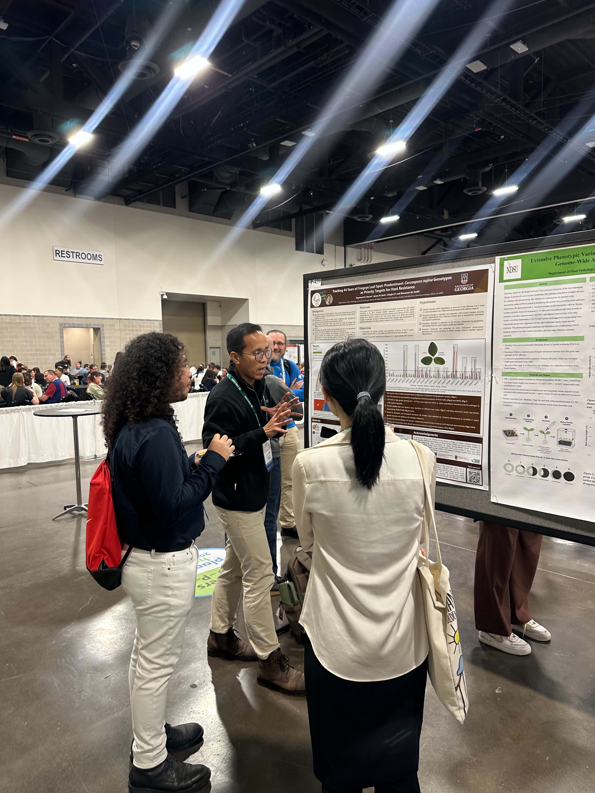
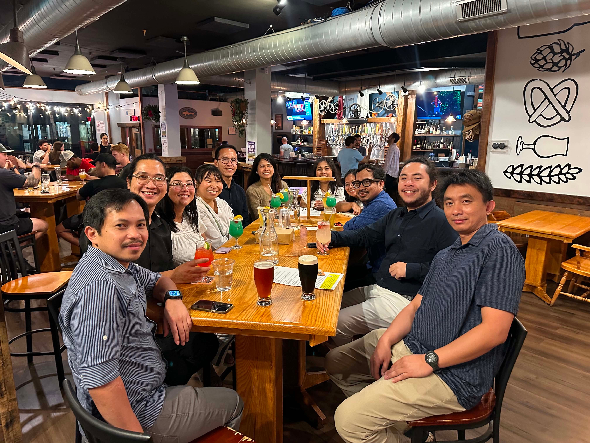
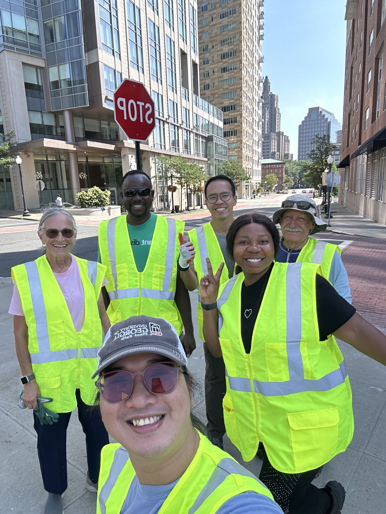
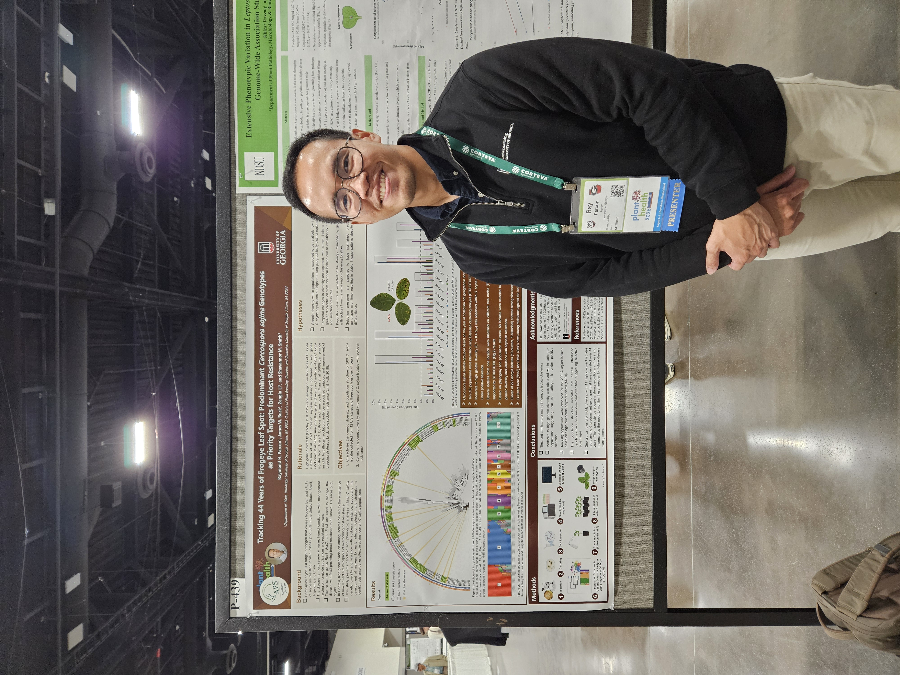

## APS 2026 Reflections

It’s that time of year again! I attended the 2026 annual APS Plant Health meeting for plant pathologists. I always look forward to this conference not only because it is the perfect venue to be see incredible research in plant pathology, but also because it gives me the chance to reconnect with friends and continue building my professional network.

# Host City and Conference Theme
This year’s conference was held in Providence, Rhode Island. I enjoyed the city’s blend of old and new architecture. It felt less busy than Atlanta, but not as quiet as Athens like somewhere comfortably in between.

::: {.post-image}
{fig-alt="View of Providence from my hotel"}
:::

The conference theme this year was diversity. I enjoyed listening to many of the talks, and I thought the keynote speakers were strong overall. The closing keynote speaker, Tererai Trent, was especially memorable and brought the conference to a powerful and meaningful close.

::: {.post-image}
{fig-alt="Dr. Tererai Trent engaging and deeply moving closing keynote speech"}
:::

# Venue, Social Events, and Overall Atmosphere
The venue was decent, though I still prefer the Hawaiʻi Convention Center. That said, the closing social was definitely better this year. The music, closer space, food, and dancing created a lively atmosphere, and everyone seemed to genuinely enjoy the celebration.

::: {.post-image}
{fig-alt="Members of the APS community closing it with a blast!"}
:::

# Talks and Poster Sessions
With regard to the talks, I’m not a big fan of short 10–12 minute presentations. It is difficult to absorb much from them, not because the speakers are not engaging, but because there simply is not enough time to provide in-depth details.

I enjoyed the poster presentations much more because the interactions felt more conversational and personal. Although the poster area could feel overwhelming because of the many impressive research on display, it was still one of the most rewarding parts of the conference.

::: {.post-image}
{fig-alt="Sharing my research I'm deeply passionate about with like-minded members of our community."}
:::

# Community and Connection
One of the reasons I enjoyed this conference even more was that I was able to reconnect with fellow Filipino plant pathology researchers and spend meaningful time with them. Our one-of-a-kind humor brought the warmth of home into a foreign land where we continue to contribute through our research and dedication.

::: {.post-image}
{fig-alt="Filipino Plant Pathologists in the U.S."}
:::

# Volunteerism 
To top it all off, I really enjoyed joining the APS Gives Back volunteer activity. We removed weeds from a small meadow which seemed like a breathing ground and a relaxing space for people to decompress while surrounded by a concrete jungle, and learned about the volunteer efforts that help maintain it. The experience showed me that when a community is involved, great things can come from collective care and effort.

::: {.post-image}
{fig-alt="A selfie of some of the volunteers."}
:::

# Final Thoughts
All in all, APS 2026 was a solid and memorable experience, and I will remember it fondly in the years to come. I am already looking forward to joining APS 2027 next year!

::: {.post-image}
{fig-alt="Standing beside my poster presentation."}
:::
