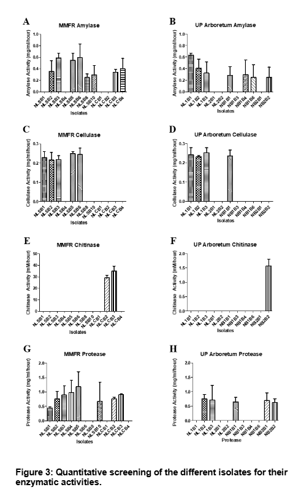

::: {.post-image}
{fig-alt="enzymatic activity"}
:::

## Abstract

Endophytic microorganisms are plant-colonizing microorganisms that cause no significant harm to the host. They are widely studied due to their production of secondary metabolites that are useful for the pharmaceutical, agricultural and food industries. The production of these metabolites also helps plants to better adapt to their environment. The species composition of endophytes can be greatly affected by environmental conditions and the location of their hosts. This study aimed to compare species and enzymatic production of endophytes isolated from Narra (Pterocarpus indicus) growing in two different locations in the Philippines i.e. the Mount Makiling Forest Reserve (MMFR) and the UP Arboretum in Quezon City. The results show that there was a higher number of bacterial genera isolated from MMFR compared to UP Arboretum. <em>Staphylococcus</em>, <em>Pseudomonas</em>, <em>Serratia</em>, <em>Pantoea</em>, and <em>Microbacterium</em> were uniquely found in the MMFR while <em>Lysinibacillus</em> was only found in the UP Arboretum. More isolates from MMFR were able to produce amylase, cellulase, chitinase and protease than those from the UP Arboretum. On the other hand, a greater percentage of endophytes from the UP Arboretum were able to produce laminarinase, L-asparaginase and xylanase. The results agree with previous studies that show that location affects the physiological activity of endophytes.

  <a 
    class="article-link"
    href="https://scienggj.org/2020/2020%20Special%20Issue/12/PSL%202020%20Special%20Issue%20120-126-Atole%20et%20al.pdf"
    aria-label="Open article PDF"
    target="_blank"
    rel="noopener"
  >
    
     PDF 
  </a>

