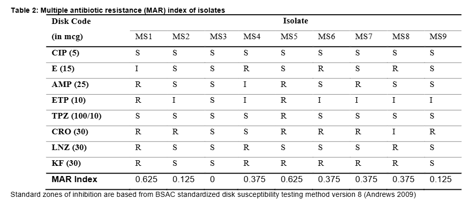

::: {.post-image}
{fig-alt="MAR index"}
:::

## Abstract

Marilao-Meycauayan-Obando River System (MMORS) is among the dirtiest and most polluted places in the world but it is still utilized for aquaculture, recreation, and water supply. Since it is contaminated with various industrial and commercial wastes, it is likely that effluents with antibiotics are also dumped into the river system. Antibiotic resistance is one of the biggest threats to global health, food security, and development. Nine (9) bacteria isolated from MMORS were screened for antibiotic resistance using eight (8) antibiotics of different classes, i.e., ciprofloxacin (5mcg), erythromycin (15mcg), ampicillin (25mcg), ertapenem (10mcg), ceftriaxone (30mcg), linezolid (30mcg), cephalothin (30mcg), and piperacillin/tazobactam (100/10mcg). MS1 and MS5 had the highest multiple antibiotic resistance (MAR) index at 0.625, followed by MS4, MS6, MS7, and MS8 at 0.375. MS2 and MS9 had MAR index of 0.125. The proportion of isolates with MAR index greater than 0.2 (66.66%) was higher than isolates with MAR index below 0.2 (33.33%), suggesting a high risk of contamination in sampling sites. Sequence analysis revealed that MS1 had 99.87% sequence similarity with <em>Bacillus pumilus</em>, MS2 with 99.30% <em>Bacillus</em> sp. sequence similarity, MS3 with 93.08% <em>Brevibacillus</em> sp. sequence similarity, MS4 with 99.90% <em>Morganella morganii</em> sequence similarity, MS5 with 100.00% <em>Bacillus cereus</em> sequence similarity, MS6 with 99.78% <em>Escherichia coli</em> sequence similarity, MS7 with 100.00% <em>Bacillus anthracis</em> sequence similarity, and MS9 with 100.00% <em>Bacillus</em> sp. sequence similarity. This study provides initial insight into multidrug-resistant bacteria and its possible risk in safety and public health in MMORS.

  <a 
    class="article-link"
    href="https://scienggj.org/2020/PSL%202020-vol13-no02-p198-205-Supnet%20et%20al.pdf"
    aria-label="Open article PDF"
    target="_blank"
    rel="noopener"
  >
    
     PDF 
  </a>

